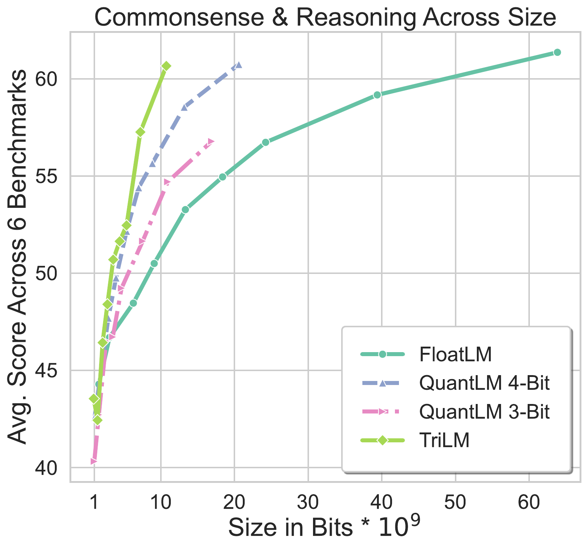

<h1 style="line-height: 50px;">   Spectra Suite
</h1>


We release the Spectra Suite consisting of 54 models ranging from 99M to 3.9B parameters across different bitwidths:
* FloatLM: LLMs pretrained in FP16 (Half-Precision).
* TriLM: LLMs pretrained with effective ternary bitwidth.
* QuantLM 8-bit: FloatLM LLMs Quantized to 8-bits.
* QuantLM 6-bit: FloatLM LLMs Quantized to 6-bits.
* QuantLM 4-bit: FloatLM LLMs Quantized to 4-bits.
* QuantLM 3-bit: FloatLM LLMs Quantized to 3-bits.

All models are released in unpacked (FP16 format) - compatible with FP16 GEMMs across any library supporting the LLaMa architecture.

## Usage:

```python
import transformers as tf, torch

# Please select the model you wish to run.
model_name = "SpectraSuite/TriLM_3.9B_Unpacked"

# Please adjust the temperature, repetition penalty, top_k, top_p and other sampling parameters according to your needs.
pipeline = tf.pipeline("text-generation", model=model_id, model_kwargs={"torch_dtype": torch.float16}, device_map="auto")

# These are base (pretrained) LLMs that are not instruction and chat tuned. You may need to adjust your prompt accordingly.
pipeline("Once upon a time")
```

| Params | FloatLM | TriLM | QuantLM 8-bit | QuantLM 6-bit | QuantLM 4-bit | QuantLM 3-bit |
| ------ | ------- | ----- | ------------- | ------------- | ------------- | ------------- |
| 99M  | [🤗 SpectraSuite/FloatLM_99M](https://huggingface.co/SpectraSuite/FloatLM_99M)   | [🤗 SpectraSuite/TriLM_99M_Unpacked](https://huggingface.co/SpectraSuite/TriLM_99M_Unpacked)   | Coming Soon | Coming Soon | Coming Soon | Coming Soon |
| 190M | [🤗 SpectraSuite/FloatLM_190M](https://huggingface.co/SpectraSuite/FloatLM_190M) | [🤗 SpectraSuite/TriLM_190M_Unpacked](https://huggingface.co/SpectraSuite/TriLM_190M_Unpacked) | Coming Soon | Coming Soon | Coming Soon | Coming Soon |
| 390M | [🤗 SpectraSuite/FloatLM_390M](https://huggingface.co/SpectraSuite/FloatLM_390M) | [🤗 SpectraSuite/TriLM_390M_Unpacked](https://huggingface.co/SpectraSuite/TriLM_390M_Unpacked) | Coming Soon | Coming Soon | Coming Soon | Coming Soon |
| 560M | [🤗 SpectraSuite/FloatLM_560M](https://huggingface.co/SpectraSuite/FloatLM_560M) | [🤗 SpectraSuite/TriLM_560M_Unpacked](https://huggingface.co/SpectraSuite/TriLM_560M_Unpacked) | Coming Soon | Coming Soon | Coming Soon | Coming Soon |
| 830M | [🤗 SpectraSuite/FloatLM_830M](https://huggingface.co/SpectraSuite/FloatLM_830M) | [🤗 SpectraSuite/TriLM_830M_Unpacked](https://huggingface.co/SpectraSuite/TriLM_830M_Unpacked) | Coming Soon | Coming Soon | Coming Soon | Coming Soon |
| 1.1B | [🤗 SpectraSuite/FloatLM_1.1B](https://huggingface.co/SpectraSuite/FloatLM_1.1B) | [🤗 SpectraSuite/TriLM_1.1B_Unpacked](https://huggingface.co/SpectraSuite/TriLM_1.1B_Unpacked) | Coming Soon | Coming Soon | Coming Soon | Coming Soon |
| 1.5B | [🤗 SpectraSuite/FloatLM_1.5B](https://huggingface.co/SpectraSuite/FloatLM_1.5B) | [🤗 SpectraSuite/TriLM_1.5B_Unpacked](https://huggingface.co/SpectraSuite/TriLM_1.5B_Unpacked) | Coming Soon | Coming Soon | Coming Soon | Coming Soon |
| 2.4B | [🤗 SpectraSuite/FloatLM_2.4B](https://huggingface.co/SpectraSuite/FloatLM_2.4B) | [🤗 SpectraSuite/TriLM_2.4B_Unpacked](https://huggingface.co/SpectraSuite/TriLM_2.4B_Unpacked) | Coming Soon | Coming Soon | Coming Soon | Coming Soon |
| 3.9B | [🤗 SpectraSuite/FloatLM_3.9B](https://huggingface.co/SpectraSuite/FloatLM_3.9B) | [🤗 SpectraSuite/TriLM_3.9B_Unpacked](https://huggingface.co/SpectraSuite/TriLM_3.9B_Unpacked) | Coming Soon | Coming Soon | Coming Soon | Coming Soon |

We will release the intermediate checkpoints over the coming weeks.

## How to compress and speedup:

For the foreseeable future, we have no plans to release the packed versions of the model or its inference kernels. But we welcome any contributions and would be happy to answer your questions.
To achieve upto 10x compression and speedup, you may need to pack the weights into low-bitwidth data formats - how you do this may vary depending on inference library (and hardware) used.

You may check out ongoing works across various open source libraries:
- https://github.com/ggerganov/llama.cpp/pull/7931
- https://github.com/ggerganov/llama.cpp/pull/8151
- https://github.com/ridgerchu/matmulfreellm

If you pack TriLM's linear layers into lower bitwidths, please take into account the Model Parallel (MP) size used to train - there may be `MP<=6` scales per weight matrix in TriLMs we release. This can be validated by the following code snippet.
```python
import transformers as tf
# Please select a TriLM model.
model = tf.AutoModelForCausalLM.from_pretrained("SpectraSuite/TriLM_3.9B_Unpacked")
for v in model.model.layers.parameters():
    if len(v.shape) == 2:
        assert len(set(v.abs().flatten().tolist())) <= (1 + model.config.pretraining_model_parallel) # 1 extra for `0` - only total of 6 scales per matrix for largest model.
```

Following are the hyperparameters for FloatLMs and TriLMs.
| Params        | Hidden | GLU  | Heads | Layers | MP |
|---------------|--------|------|-------|--------|----|
| 99.74M (99M)  | 512    | 1280 | 8     | 16     | 1  |
| 190.0M (190M) | 768    | 2048 | 12    | 16     | 1  |
| 392.4M (390M) | 1024   | 2560 | 16    | 24     | 1  |
| 569.2M (560M) | 1280   | 3072 | 20    | 24     | 1  |
| 834.0M (830M) | 1536   | 4096 | 24    | 24     | 1  |
| 1.149B (1.1B) | 1792   | 5120 | 28    | 24     | 2  |
| 1.515B (1.5B) | 2048   | 6144 | 32    | 24     | 2  |
| 2.461B (2.4B) | 2304   | 7680 | 36    | 30     | 3  |
| 3.989B (3.9B) | 3072   | 9216 | 24    | 30     | 6  |

You may additionally also need to account for other differences in modeling - no quantization for embedding, lm head and activation. TriLM has RMSNorm (with parameter like LLaMa, not the parameterless RMSNorm), SwiGLU Gated MLP, Rotary Position Embedding (RoPE), Multi-Headed Attention and no bias terms. Generally take any LLaMa implementation, and switch its linear layers to our TriLM's linear layer.

Feel free to open a GH issue if you have any questions here.

## Replicating our evaluation

First setup lm eval harness 0.4.2 and grab the HF model name, for example `SpectraSuite/TriLM_3.9B_Unpacked`. Then run following 0-shot evaluation script.

```bash
lm_eval --model hf --model_args pretrained=SpectraSuite/TriLM_3.9B_Unpacked --tasks arc_easy,arc_challenge,hellaswag,boolq,piqa,winogrande,lambada_openai,sciq,logiqa,mmlu_continuation,triviaqa,crows_pairs_english,truthfulqa_mc1 --device auto --batch_size 1
```

<div style="display: flex; flex-wrap: wrap; justify-content: space-between;">
    
    
    
    
    
    
    
    
</div>

## Bias, Risks, and Limitations

Primary use case of this model to further the understanding of LLMs pretrained with ultra-low bitwidths - comparative performance, training dynamics, interpretability, efficient inference and better optimization schedule.

The model may generate responses that are inaccurate, lack essential information, or contain irrelevant or socially inappropriate content, regardless of the nature of the input prompt. The base model is known to be as toxic and stereotyping as other language models of similar parameter count.

This model has only been pretrained for 300B tokens, without any instruction tuning and safety alignment. We recommend you to continually pretrain, instruction tune and safety align it for your usecase.

## Citation
If you find these models or the associated paper useful, please cite the paper:

```bibtex
@misc{kaushal2024spectracomprehensivestudyternary,
      title={Spectra: A Comprehensive Study of Ternary, Quantized, and FP16 Language Models}, 
      author={Ayush Kaushal and Tejas Pandey and Tejas Vaidhya and Aaryan Bhagat and Irina Rish},
      year={2024},
      eprint={2407.12327},
      archivePrefix={arXiv},
      primaryClass={cs.LG},
      url={https://arxiv.org/abs/2407.12327}, 
}
```

## Misc
* **License**: All these models are released under Apache 2.0 License and can be accessed via Huggingface.
* We will use this GitHub repo for communication (including HF repo related queries). Feel free to open an issue.
